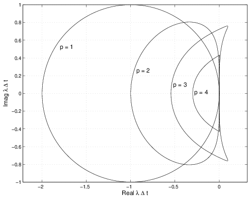
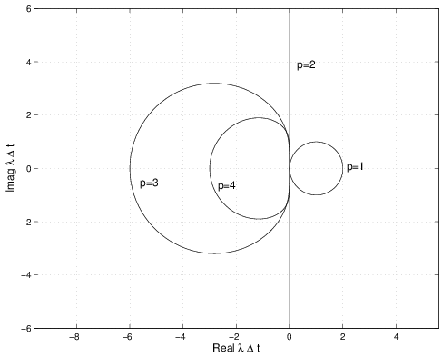
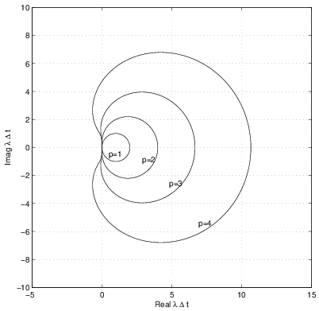

# Numerical Integration of ODEs

Notes from the online course at MIT OpenCourseWare

## First order ODEs

Let us consider the general first order ODE of the unknown variable $u(t)$:

$$
    u_t = f(u(t), t) \qquad u(0) = u_0 \qquad 0 \leq t \leq T
$$

The time interval $[0, T]$ is discretized with a timestep $\Delta t$ and the numerical approximation of $u(n\Delta t)$ is denoted $v^n$. The numerical scheme is denoted by:

$$
    v^{n + 1} = N(v^i, t^i, \Delta t)
$$

where $i$ spans the set of all indices required by the numerical scheme.

In the case of an $s$-multistep method

$$
    v^{n + 1} + \sum_{i=1}^s \alpha_i v^{n + 1 - i} = \Delta t \sum_{i = 0}^s \beta_i f^{n + 1 - i}
$$

### Local order of accuracy and consistency

The local truncation error (LTE) is defined as

$$
    \tau = N(u^i, t^i, \Delta t) - u^{n + 1}
$$

The local order of accuracy $p$ is

$$
    | \tau | = \mc{O}(\Delta t^{p + 1})
$$

The global error $e(T) = u(T) - v^{T/\Delta t}$ is expected to behave as

$$
\begin{aligned}
    &e(T) = \sum_{n = 1}^{T/\Delta t} \Delta e^n \\
    \implies &e(T) = \sum_n \mc{O}(\Delta t^{p + 1}) \\
    \implies &e(T) = \mc{O}(\Delta t^p)
\end{aligned}
$$

Consistency requires that the scheme be at least first order ($p = 1$) for the numerical method to capture the model.

### Convergence and global order of accuracy

A finite difference method for solving

$$
    u_t = f(u(t), t) \qquad u(0) = u_0 \qquad 0 \leq t \leq T
$$

is convergent if

$$
    \max_{n \in \intint{0}{T/\Delta t}} |v^n - u(n\Delta t)| \to 0 \qquad \text{as} \qquad \Delta t \to 0
$$

The method is said to have global order of accuracy $p$ if

$$
    \max_{n \in \intint{0}{T/\Delta t}} |v^n - u(n\Delta t)| \leq \mc{O}(\Delta t^p)
$$

for any $f(u, t)$ that is of class $\mc{C}^p$ on $\R \times [0, T]$.

### Stability

Let us consider the unforced problem associated to an $s$-multistep method

$$
    v^{n + 1} + \sum_{i=1}^s \alpha_i v^{n + 1 - i} = 0
$$

A multistep method is stable if all solutions to the previous are bounded as $n\to +\infty$

In practice we assume that the solution has the following form

$$
    v^n = v^0 z^n
$$

We solve the unforced problem in $z$, determine the roots of the polynomial and check whether or not $|z| \leq 1$. For a multistep method $|z| = 1$ is stable only if it is a simple root.

### Dahlquist Equivalence Theorem

A stable and consistent $s$-multistep method is convergent (similar to Lax Theorem).

### Systems of ODEs and Implicit integration

Taking an $s$-multistep method:

$$
    v^{n + 1} + \sum_{i=1}^s \alpha_i v^{n + 1 - i} = \Delta t \sum_{i = 0}^s \beta_i f^{n + 1 - i}
$$

Assuming $\beta_0 \neq 0$:

$$
\begin{aligned}
    v^{n + 1} - \Delta t \beta_0 f(v^{n + 1}, t^{n + 1}) + \sum_{i=1}^s \alpha_i v^{n + 1 - i} - \sum_{i = 1}^s \beta_i f^{n + 1 - i} = 0 \\
    R(w) = w - \Delta t \beta_0 f(w, t^{n + 1}) + \sum_{i=1}^s \alpha_i v^{n + 1 - i} - \sum_{i = 1}^s \beta_i f^{n + 1 - i} = 0 \\
\end{aligned}
$$

Setting an initial guess for $v^{n + 1}$ as $w^0$, we iterate from step $m$ to step $m+1$ in the following fashion:

$$
\begin{aligned}
    R(w^{m+1}) &= 0 \\
    R(w^m + \Delta w) &= R(w^m) + \left.\pdv{R}{w}\right|_{w^m} \Delta w = 0 \\
    \left.\pdv{R}{w}\right|_{w^m} \Delta w &= - R(w^m)
\end{aligned}
$$
where
$$
\left.\pdv{R}{w}\right|_{w^m} = I - \Delta t \beta_0 \left.\pdv{f}{u}\right|_{w^m}
$$

Newton-method:

$$
    f'(x_n)(x_{n + 1} - x_n) = - f(x_n)
$$

### Systems of ODEs and Eigenvalue stability

Let us consider a system of ODEs

$$
    u_t = f(u, t) \qquad u(0) = u_0
$$

where

$$
    u = \begin{bmatrix}
        u_1 \\
        u_2 \\
        \vdots\\
        u_d
    \end{bmatrix}
    \qquad
    f = \begin{bmatrix}
        f_1 \\
        f_2 \\
        \vdots\\
        f_d
    \end{bmatrix}
$$

We linearize around the initial solution

$$
\begin{aligned}
    u &= u_0 + \tilde{u} \\
    f(u, t) &= f(u_0, t_0) + \pdv{f}{u}(u_0, t_0) \tilde{u} + \pdv{f}{t}(u_0, t_0)t + \mc{O}(||\tilde{u}||^2, ||\tilde{u}||t, t^2)
\end{aligned}
$$

The system thus becomes:

$$
    \tilde{u}_t = A(t) \tilde{u} + b(t)
$$

where 

$$
    A = \pdv{f}{u}(u_0, t_0) \qquad b = f(u_0, t_0) + \pdv{f}{t}(u_0, t_0)t
$$

Supossing a stationary problem and $f(u_0, t_0) = 0$, the system becomes

$$
    \tilde{u}_t = A \tilde{u}
$$

To study the stability of a system of ODEs the following steps are taken

1. Set $v^n = g^n v^0$ where $g$ is the amplification factor in the scheme
2. Set $f^n = g^n v^0 \lambda$ (imply linearization and reduction) where $\lambda$ is an eigenvalue in fact of the specific problem at hand
3. Solve for the roots of the polynomial in $g$ where the roots depend on $\lambda \Delta t$
4. Determine the regions where $|g| \leq 1$

### Multi-step methods

#### Adams-Bashforth methods

$$
    v^{n + 1} - v^n = \Delta t \sum_{i = 1}^s \beta_i f^{n + 1 -i}
$$

#### Adams-Moulton methods

$$
    v^{n + 1} - v^n = \Delta t \sum_{i = 0}^s \beta_i f^{n + 1 -i}
$$

#### Backward differentiation methods (used in CVODE)

$$
    v^{n + 1} + \sum_{i=1}^p \alpha_i v^{n + 1 - i} = \Delta t \beta_0 f^{n + 1}
$$

Expressing the derivative operator $D$ in terms of increment operator $E$ yields:

$$
    D = \frac{1}{\Delta t} \sum_{k=0}^{+\infty} \frac{(1 - E^{-1})^k}{k}
$$

Expanding the product and rearranging the sums yield:

$$
\begin{aligned}
    \beta_0 &= \left(\sum_{k=1}^p \frac{1}{k}\right)^{-1} \\
    \alpha_1 &= \beta_0 (-1)^i p \\
    \alpha_i &= \beta (-1)^i \sum_{k=i}^p \frac{1}{k} \binom{k}{i} \\
    \sum_{i=1}^p \alpha_i &= -1
\end{aligned}
$$

